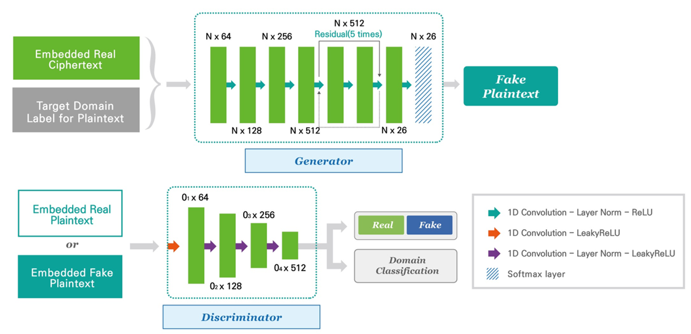

# UC-GAN

Automated Classical Cipher Emulation Attacks via Unified Unsupervised Generative Adversarial Networks

Torch implementation for learning a mapping between Plain text to Cipher Text



## Setup

### Prerequisites

- Linux or OSX
- NVIDIA GPU + CUDA CuDNN (CPU mode and CUDA without CuDNN may work with minimal modification, but untested)

### Getting Started

- Clone this repo:

```bash
git clone git@github.com:tdn02007/UC-GAN-Unified-cipher-generative-adversarial-network.git
cd UC-GAN-Unified-cipher-generative-adversarial-network
```

### Lib

The code to make cipher text.

- caeser.py: Caeser
- substitution.py: Substitution
- vigenere.py: Vigenere
- cipher.py: Encryption Test code

### data

Only samples have been uploaded to test the code above.

Structure

- data
  - train
    - 0.plain
    - 1.caeser
    - 2.vigenere
    - 3.substitution
  - test
    - 0.plain
    - 1.caeser
    - 2.vigenere
    - 3.substitution

## Train

```bash
python main.py
```
